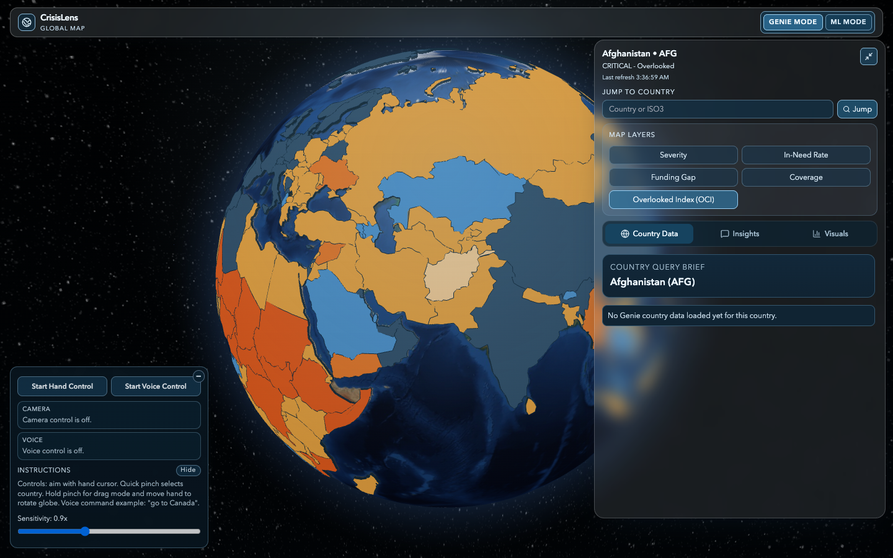
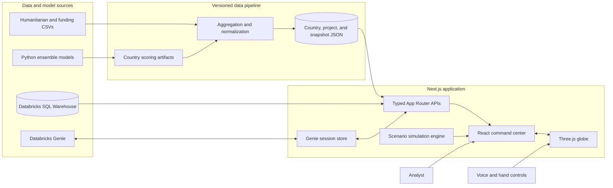
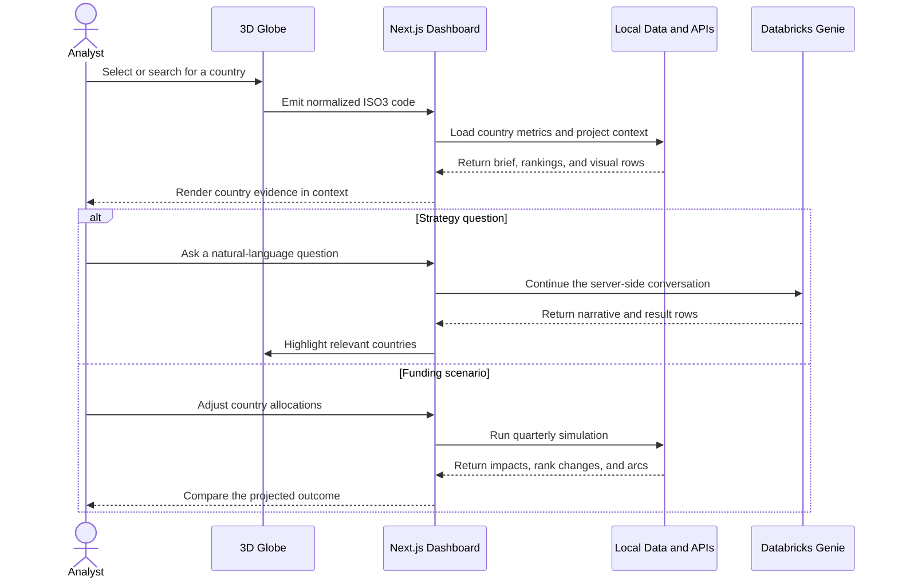

<div align="center">

# CrisisLens

### AI-assisted crisis intelligence on an interactive global command center

[](#recognition)
[](https://nextjs.org/)
[](https://www.databricks.com/)
[](https://www.typescriptlang.org/)

CrisisLens turns fragmented humanitarian risk, population, and funding data into country-level priorities that response teams can explore, question, and simulate from one workspace.

</div>



## From scattered signals to a country decision

| 1. Explore | 2. Investigate | 3. Simulate |
| --- | --- | --- |
| Rotate or search the 3D globe and switch between severity, people-in-need, funding-gap, coverage, and Overlooked Crisis Index layers. | Open a country brief, compare rankings and visual evidence, or ask Databricks Genie a natural-language question without leaving the map. | Change funding allocations and inspect quarterly forecasts, leaderboard movement, country impacts, and map arcs before acting. |

## What the platform delivers

| Capability | Recruiter-level summary | Engineering behind it |
| --- | --- | --- |
| **Global risk map** | Makes 164 country records explorable through a responsive, selectable 3D globe. | `react-globe.gl`, Three.js, raycasting, animated camera transitions, and five metric layers. |
| **Country intelligence** | Brings population, need, funding, severity, and project context into one country brief. | Typed Next.js route handlers backed by committed, normalized JSON snapshots containing 5,988 project records. |
| **Natural-language analysis** | Converts analyst questions into ranked country findings and map highlights. | Databricks Genie conversations, server-side session continuity, normalized result parsing, retry guidance, and SQL Warehouse data. |
| **Scenario planning** | Shows how proposed funding changes affect priorities across future quarters. | Deterministic simulation logic, ML context, impact scoring, comparison charts, and geographic relationship arcs. |
| **Hands-free navigation** | Lets a presenter select and explore countries through voice or camera-based hand controls. | Browser Speech Recognition, MediaPipe vision tasks, confidence-gated country selection, and shared globe commands. |
| **Dual workspaces** | Separates strategy questions from deeper model and simulation analysis. | Isolated Genie and ML modes with dedicated panels, state, visualizations, and API contracts. |

## System architecture



## Analyst flow



## Recognition

**First place, Databricks Challenge at Hacklytics 2026**, selected from a 234-project field.

The project combined a working geospatial interface, Databricks-backed natural-language analysis, country-level scoring, and scenario planning into a single hackathon product.

## Technical decisions

- **Geography stays visible.** The globe remains the primary workspace while briefs, rankings, charts, and queries update around the selected country.
- **External systems sit behind adapters.** Databricks, Genie, and computer-vision integrations use typed seams so UI code does not depend on provider response shapes.
- **Generated data is committed.** A local clone can open the full dashboard without private challenge datasets or cloud credentials.
- **ISO3 is the shared key.** Search, voice commands, CV output, API routes, simulations, and globe selection converge on one country identifier.
- **Complex logic is testable outside the canvas.** Metrics, simulation, query parsing, globe picking, and visualization transforms live in deterministic helpers covered by Vitest.

## Stack

| Layer | Technologies |
| --- | --- |
| Web | Next.js 14, React 18, TypeScript, Tailwind CSS, Framer Motion |
| Geospatial | Three.js, `react-globe.gl`, D3 Geo, TopoJSON |
| Intelligence | Databricks SQL Warehouse, Databricks Genie, AI model endpoints |
| Modeling | Python, pandas, NumPy, scikit-learn, LightGBM, XGBoost |
| Interaction | MediaPipe Tasks Vision, Web Speech API |
| Quality | Vitest, Playwright, ESLint, strict TypeScript |
| Delivery | pnpm workspaces, Docker, GitHub Actions |

## Run locally

### Prerequisites

- Node.js 20+
- pnpm 10+

### Start the dashboard

```bash
git clone https://github.com/azizu06/CrisisLensV2.git
cd CrisisLensV2
pnpm install
pnpm dev
```

Open [http://localhost:3000](http://localhost:3000) for the landing page or [http://localhost:3000/dashboard](http://localhost:3000/dashboard) for the command center. The committed data snapshot supports the local globe, country metrics, project context, ML mode, and scenario tools without additional credentials.

### Connect Databricks

Create `apps/web/.env.local` to enable live Genie and Databricks-backed routes:

```dotenv
DATABRICKS_HOST=https://your-workspace.cloud.databricks.com
DATABRICKS_TOKEN=your-token
DATABRICKS_WAREHOUSE_ID=your-warehouse-id
GENIE_SPACE_ID=your-genie-space-id
CRISIS_TABLE_FQN=workspace.schema.crisislens_master
AI_MODEL=databricks-llama-4-maverick
```

Optional overrides:

| Variable | Purpose |
| --- | --- |
| `DATABRICKS_AI_ENDPOINT` | Selects a serving endpoint when it differs from `AI_MODEL`. |
| `DATABRICKS_AI_CHAT_PATH` | Overrides the default AI Gateway chat path. |
| `NEXT_PUBLIC_GLOBE_WS_URL` | Streams anomaly or country-highlight events into the globe. |

### Regenerate the data snapshot

The normalized JSON artifacts are already committed. If you have the raw challenge CSV exports in `apps/web/data`, rebuild them with:

```bash
pnpm run generate:data
```

## Verify the project

```bash
pnpm run test:unit   # deterministic domain and visualization logic
pnpm run test        # ESLint and strict TypeScript checks
pnpm run build       # production Next.js build
pnpm run test:e2e    # browser flows and API contracts
```

Sixteen Vitest and Playwright files cover the dashboard, landing experience, API contracts, country metrics, Genie summaries, simulation behavior, globe picking, arcs, and CV-to-globe coordination.

## Repository map

```text
apps/
├── ml/                      # model training code and retained scoring artifacts
└── web/
    ├── app/                 # routes, pages, and server APIs
    ├── components/          # landing, globe, dashboard, and command-center UI
    ├── lib/                 # metrics, simulations, integrations, and domain types
    ├── public/data/         # normalized country and project snapshots
    ├── scripts/             # reproducible data aggregation
    └── tests/               # Vitest and Playwright suites
docs/                        # technical context and architecture notes
```

## Security and data boundaries

- Databricks tokens and workspace identifiers are read only by server-side modules; never expose credentials through a `NEXT_PUBLIC_` variable.
- Genie conversation identifiers are stored in HTTP-only cookies with secure transport enabled in production.
- API integrations normalize provider responses before sending data to the client.
- The public repository contains generated challenge artifacts and model outputs, not Databricks credentials.
- Camera and microphone controls require an explicit user action in the browser and remain off by default.

---

<div align="center">
Built for Hacklytics 2026 at Georgia Tech.
</div>
